# __Integra-o-Proxmox-ao-google-drive__

### __1- Acesso à interface de linha de comando.__

O primeiro passo é acessar o PVE(Proxmox web).
	Em seguida, clicar no node da máquina.
  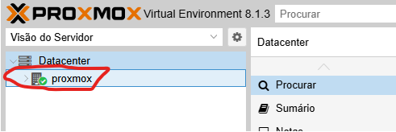

Ao clicar no node, algumas opções aparecerão no canto superior direito da tela. Clique em “Shell”.
	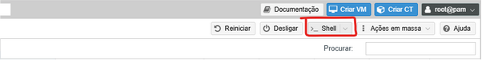

### __1.1 - Instalação e configuração do serviço rclone.__

O rclone é responsável por tornar a comunicação possível.Quando clicar, um terminal será aberto. Nesse terminal teremos que realizar a instalação e configuração do Rclone. Para instala-lo, basta apenas um comando simples, mas sua configuração precisa ser seguida com cuidado e atenção. Siga os comandos abaixo(Todos os comandos serão acompanhados pela sua devida explicação na linha subsequente a ele. Nenhum comando será maior que uma linha):

__apt install rclone -y__
Comando para instalar o rclone.

### __1.1.2 - Configuração rclone.__

O rclone funciona obedecendo um arquivo de configuração que é criado no momento da instalação, mas que vem vazio. Para ajustar ele, vamos configura-lo.

__rclone config__
Comando para abrir o painel de configuração do serviço. 
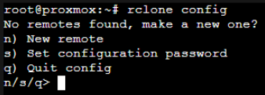  

Quando o comando for digitado, algumas opções aparecerão. Vamos digitar __n__ para selecionar “New remote”. Após selecionar, serão exibidas varias configurações. Basta seguir os passos abaixo. 

__Nome:__ gdrive (Pressione Enter) 
__Storage:__ Procure o número correspondente ao Google Drive e digite ele, em seguida pressione Enter. 
__Client ID:__ Deixar em branco (pressione Enter). 
__Client secret:__ Deixar em branco (pressione Enter). 
__Scope:__ Escolha a opção 1 (Full access)e em seguida pressione Enter. 
__Service Account File:__ Deixe em branco (pressione Enter). 
__Edit advanced config:__ n (Pressione Enter). 
__Use auto-config:__ n (Pressione Enter) 

O sistema agora deve pedir um token. Esse token é exclusivo de cada ligação com cada conta. Para conseguir o token, siga o passo a passo abaixo com muita atenção! 

1.1.3 - Obtenção do token. 
	1.1.3.2 - Necessário apenas na primeira vez que for executar o procedimento no seu próprio computador. 

No seu computador agora, acesse: [https://rclone.org/downloads/](https://rclone.org/downloads/)  
Desça a tela um pouco até aparecer uma tabela com opções de download. Se estiver no Windows, basta clicar na opção destacada na imagem abaixo. Senão, selecione de acordo com seu sistema operacional.  

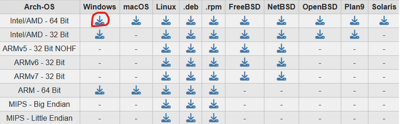  

Após baixar, o arquivo virá compactado.  
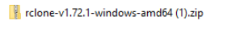 

Clique com o botão direito no arquivo e clique em “Extrair tudo”. 
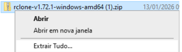  

Uma nova janela será aberta. Clique em “Extrair”.
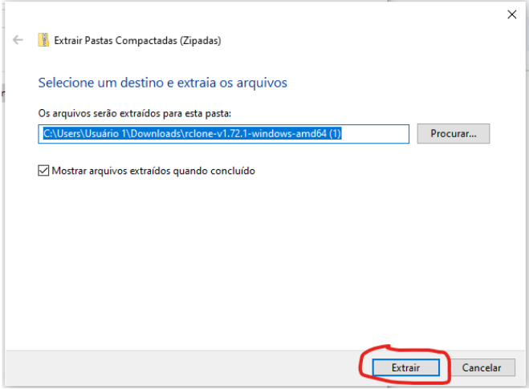 

Após o fim da extração, será gerada uma pasta. Renoimeie-a para “rclone”. 

Clique uma vez em cima da pasta e pressione “CTRL + X” para recortar a pasta. Agora, no menu lateral esquerdo o explorador de arquivos, desça até achar “Disco local (C:)” e clicar nele. Pressione “CTRL + V” para colar a pasta ali. 

Abra a pasta e clique no endereço dela e pressione “CTRL+C” para copiar o endereço. 

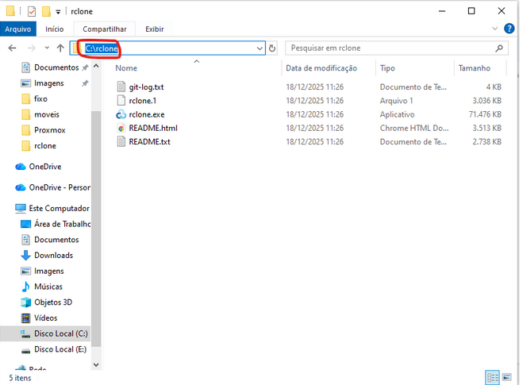

Dê 2 cliques no arquivo rclone.exe para baixar-lo no seu computador. 

Na próxima etapa vamos adicionar o caminho para o sistema reconhecer o rclone. 
Aperte o botão do windows no teclado e digite “variáveis de ambiente” e pressione enter. 
Na janela que for aberta, dê 2 cliques em “Path”. 
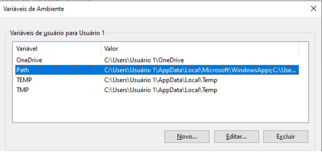  

Na nova janela, clique em “novo” e cole o endereço da pasta que copiamos anteriormente. 
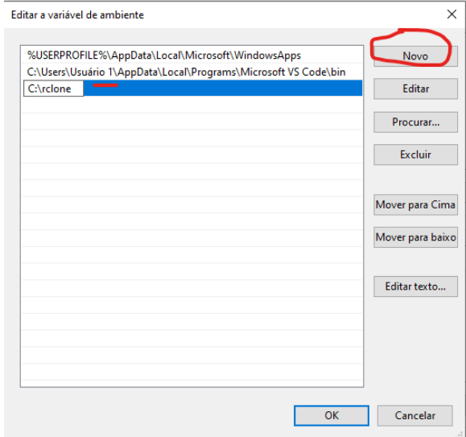 

Aperte “ok” e feche as interfaces que foram abertas. 

__1.1.3__  
 Aperte o botão do windows e digite “PowerShell”. Do lado direito do resultado, clique em “executar como administrador”.  
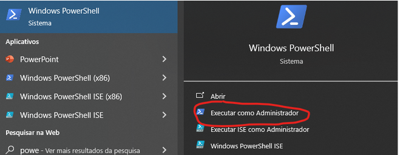  

Quando o PowerShell abrir, volte ao shell do proxmox e selecione com o mouse a area destacada abaixo:  
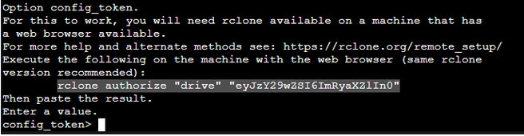  

Clique com o botão direito em cima da área e copie.  

Volte no PowerShell e pressione “CTRL+V” para colar o comando na interface e pressione enter.  

Uma janela no navegador será aberta pedindo login. Acesse com a conta para a qual será feita a integração.  

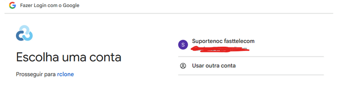  

Clique em continuar. 
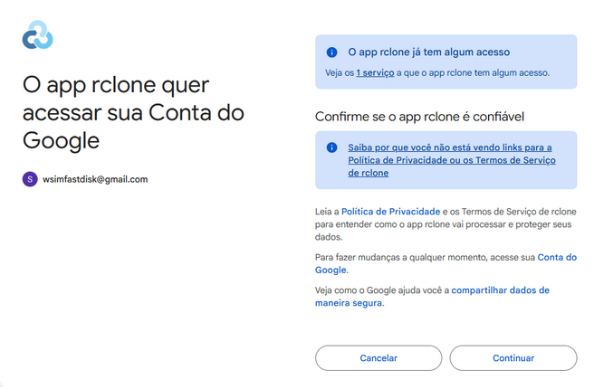  

Agora no PowerShell o token terá sido disponibilizado. Basta selecionar ele com o mouse e clicar com o botão direito que será automaticamente copiado. Depois de copiar, basta voltar no terminal do proxmox e clicar com o botão direito e clicar em colar e dar enter. Basta continuar com a configuração conforme instruído.  

__Shared Drive:__ n e pressione Enter.  
__Keep this "gdrive" remote:__ y e pressione Enter.

Agora nossa conexão com o drive foi feita! Você pode sair do menu de configurações do rclone pressionando __q__.

### __1.2 - Montando o caminho local.__
Para consigamos ver o google drive dentro so sistema, mesmo com ele conectado precisamos de uma pasta para conseguir uma comunicação mais clara e limpa com ele, por isso vamos montar uma pasta especifica pra isso, até para não mexermos onde não deveriamos.
Rode o comando:
__mkdir -p /mnt/gdrive__
Cria uma pasta com comunicação externa.

Agora, acesse a pasta que criamos. Use o comando a baixo:  
__cd /mnt/gdrive__  
Navega até a pasta que criamos.  
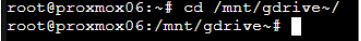  

Fizemos a rua, agora vamos por as placas. Rode o seguinte comando:  
__rclone mount gdrive:"backup_prox" /mnt/gdrive --vfs-cache-mode writes --allow-other --dir-cache-time 2s --daemon__  
Estabelece uma “placa” de onde fica a pasta que usaremos dentro do drive.  

Use o comando ls para confirmar. A saida deve ser essa:  
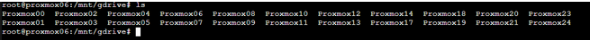  

### __1.3 - Implantação do backup e aplicação da exclusão de 2 dias.__ 

Para fazermos isso, é bastante simples. Acesse o PVE(proxmox web) e clique no datacenter.
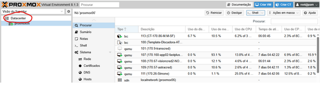  

Agora acesse a aba “Armazenamento” e clique em adicionar.  
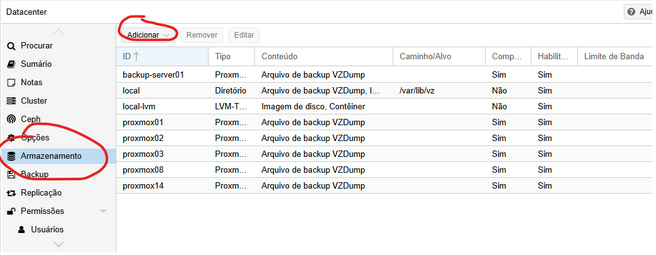  

Em seguida, “Diretório”.  
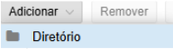  

Agora, deixe as informações da janela que será aberta iguais à imagem a baixo, mudando somente o numero do proxmox no campo “Diretório”. Nesse exemplo é o Proxmox06, mas substitua pelo proxmox correto.  
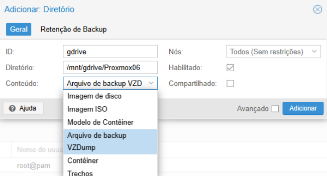  

Na sub-aba "Retenção de backup" ao lado, desmarque a caixa “Manter todos os backups” e deixe como a imagem abaixo.Após deixar igual, basta clicar em “Adicionar”.  
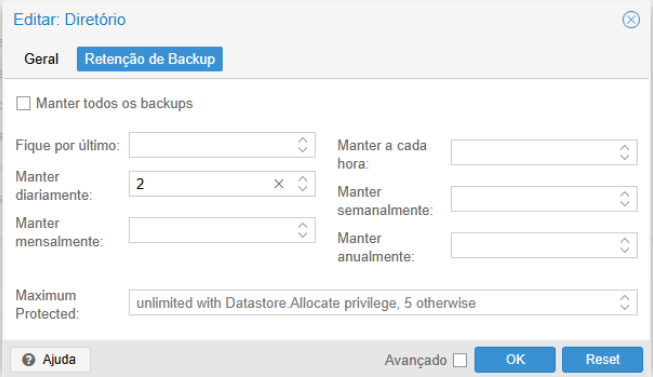  

Agora que adicionamos o novo local de armazenamento, vamos criar uma rotina de backup. Clique no campo “Backup” logo abaixo de onde estavamos. Em seguida, clique em adicionar.  
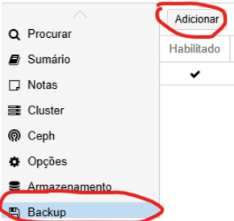  

Assim que clicar em “adicionar”, preencha os campos de acordo com a imagem abaixo. Atenção no campo “Nós”, “Agendar” e “Modo de seleção”. Em “Nós” o nome será de acordo com o proxmox que você estiver. Em “Agendar”, o horário deverá ser confirmado com o supervisor. E em “Modo de seleção”, ele vai deixa você selecionar as máquinas que serão selecionadas para o backup, basta marcar as que deverão ser incluídas. Agora basta clicar em "Criar".  
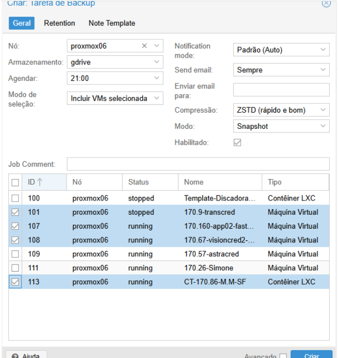  

### __2.0 - Comandos uteis.__

rclone move /mnt/gdrive/ProxmoxQueVoceQuer/NomeDoArquivo+extensão gdrive:backup_prox/ProxmoxQueVoceQuer
Move do servidor para o Drive.

rclone move gdrive:backup_prox/ProxmoxQueVoceQuerNome/DoArquivo+extensão /mnt/gdrive/ProxmoxQueVoceQuer
Move do Drive para o servidor.
